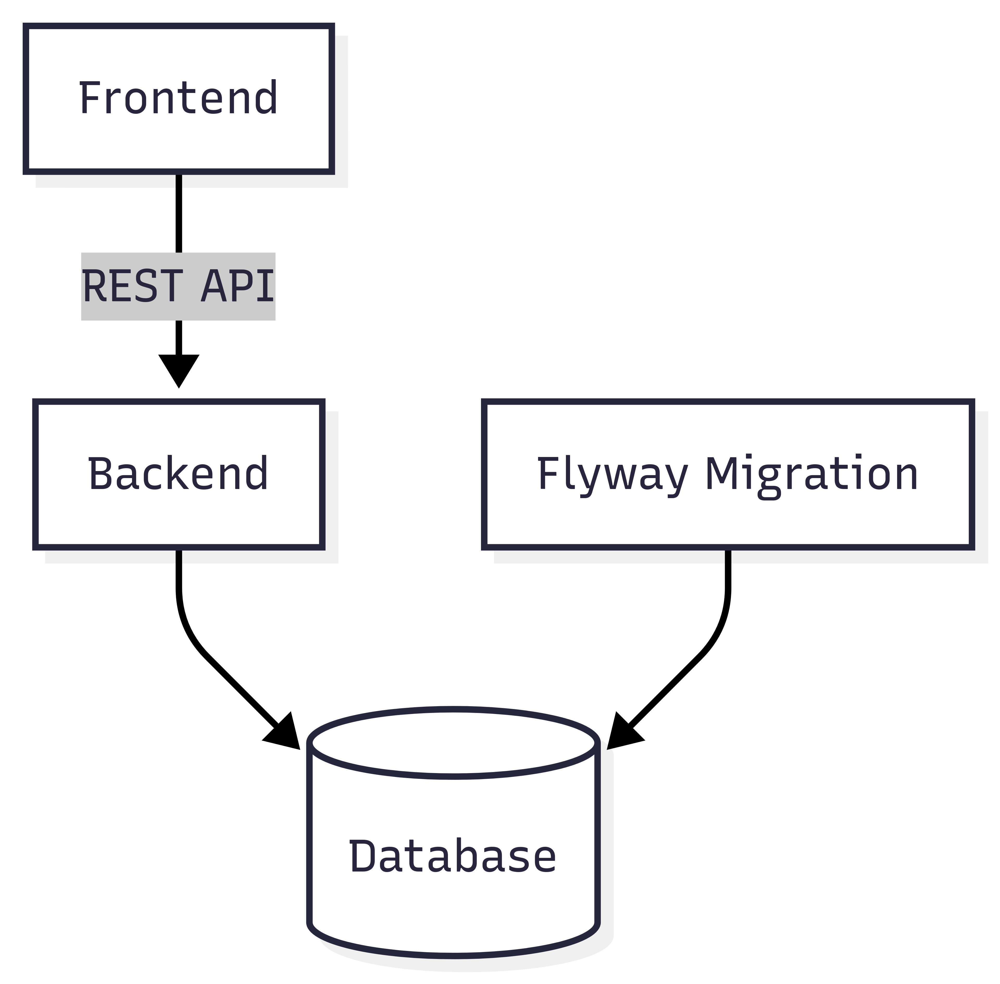

# 🧾 Employee Payroll System

## 📌 Detail

### 🏢 Business Domain or Category

**Payroll System**

### 📝 Project Description

A service for calculating employee payroll at the end of each month.

### 🎯 Why

To reduce human error caused by manual payroll calculations.

---

## 🧱 Overall Architecture

  

